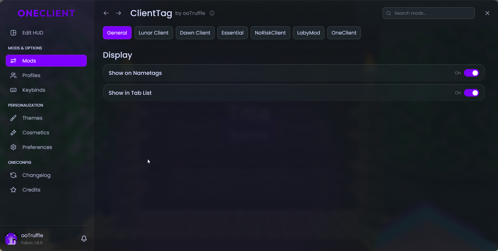

# Client Tag 

# AI Disclosure
This is HEVALY vibecoded mod to cleanroom the various websockets, feel free to pr to clean up the code^^

# What this Mod is

This is a mod to allow you to see client indicators for vaious clients without needing to be on said client

This mod can be used standalone (it Pulls fabric-api) however its recomended to have [OneConfig](https://github.com/Polyfrost/OneConfig) installed as it provides ingame config menus

# Warning

This mod possibly breaks various services TOS, by installing this mod you agree that you may get your account banned on these services